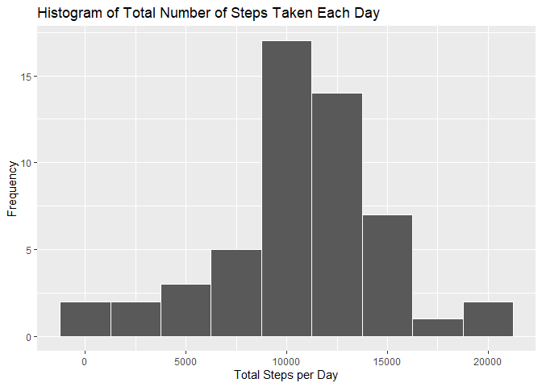
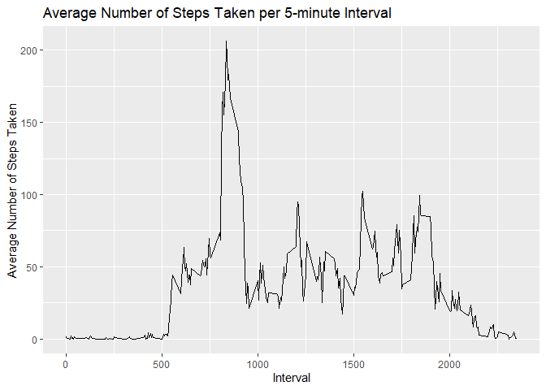
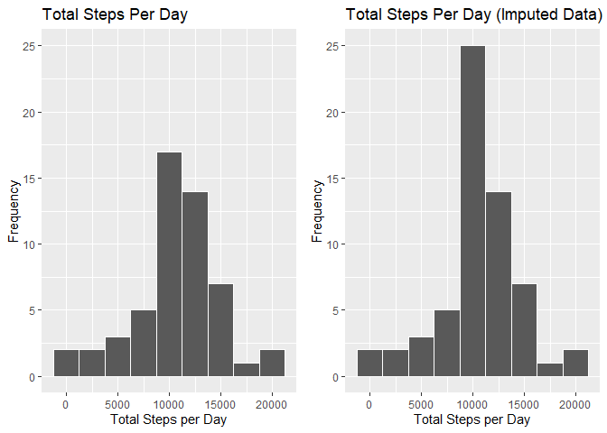
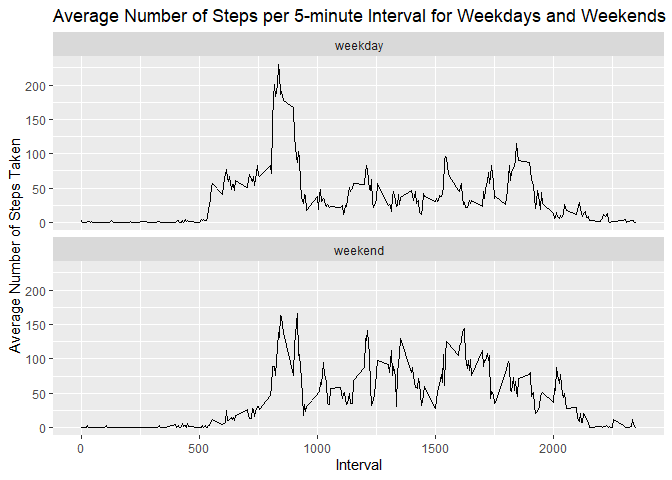

## Introduction
This assignment makes use of data from a personal activity monitoring device. This device collects data at 5 minute intervals through out the day. The data consists of two months of data from an anonymous individual collected during the months of October and November, 2012 and include the number of steps taken in 5 minute intervals each day. The dataset used for this analysis may be downloaded [here](https://d396qusza40orc.cloudfront.net/repdata%2Fdata%2Factivity.zip).

This report contains the analysis of the linked dataset to answer several questions about the data.

## Loading and preprocessing the data

The first step of this analysis is to download the data and read it into R. The following code checks if the data is downloaded, unzipped, and read into R. If this has not been done yet, then this script downloads, unzips, and loads the data into R.


```r
fileurl <- "https://d396qusza40orc.cloudfront.net/repdata%2Fdata%2Factivity.zip"
if (!("activity.zip" %in% dir())){
    download.file(fileurl)
}
if (!("activity.csv" %in% dir())){
    unzip("activity.zip")
}
if (!(exists("activity"))){
    activity <- read.csv("activity.csv")
}
```

Now we'll take a look into the dataset:


```r
str(activity)
```

```
## 'data.frame':	17568 obs. of  3 variables:
##  $ steps   : int  NA NA NA NA NA NA NA NA NA NA ...
##  $ date    : chr  "2012-10-01" "2012-10-01" "2012-10-01" "2012-10-01" ...
##  $ interval: int  0 5 10 15 20 25 30 35 40 45 ...
```

We can see that there are 17,568 observations and 3 columns: steps, date, and interval. However, the date column is formatted as a character. With the following script, this column is converted into a Date object.


```r
activity$date <- as.Date(activity$date, "%Y-%m-%d")
```

Now the date column is formatted as a Date and the data is ready for analysis:


```r
str(activity)
```

```
## 'data.frame':	17568 obs. of  3 variables:
##  $ steps   : int  NA NA NA NA NA NA NA NA NA NA ...
##  $ date    : Date, format: "2012-10-01" "2012-10-01" ...
##  $ interval: int  0 5 10 15 20 25 30 35 40 45 ...
```

## What is mean total number of steps taken per day?

First, we will take a look at the average number of steps taken per day. For now we will just ignore the NA values in the dataset.

To make this analysis, first the total number of steps taken per day has to be calculated. This is done using the `dplyr` package. The first line of the following script loads the `dplyr` package, and the second line calculates the sum of the *steps* variable grouped by *date* and stores the result in `steps_per_day`.


```r
library(dplyr)
```

```
## 
## Attaching package: 'dplyr'
```

```
## The following objects are masked from 'package:stats':
## 
##     filter, lag
```

```
## The following objects are masked from 'package:base':
## 
##     intersect, setdiff, setequal, union
```

```r
steps_per_day <- activity %>% group_by(date) %>% summarise(total_steps=sum(steps))
```

```
## `summarise()` ungrouping output (override with `.groups` argument)
```

Let's take a look at `steps_per_day`:


```r
head(steps_per_day)
```

```
## # A tibble: 6 x 2
##   date       total_steps
##   <date>           <int>
## 1 2012-10-01          NA
## 2 2012-10-02         126
## 3 2012-10-03       11352
## 4 2012-10-04       12116
## 5 2012-10-05       13294
## 6 2012-10-06       15420
```

We can see that in this dataset, the *date* column shows the date and the *total_steps* column has the total number of steps taken that day.

Now we will take a look at the histogram for the total number of steps taken per day, using the `ggplot2` package. There is a warning alerting that there are NA values in the data, which we will ignore for now.


```r
library(ggplot2)
ggplot(steps_per_day, aes(x = total_steps)) + geom_histogram(binwidth=2500, color = "white") + labs(x = "Total Steps per Day", y = "Frequency", title = "Histogram of Total Number of Steps Taken Each Day")
```

```
## Warning: Removed 8 rows containing non-finite values (stat_bin).
```

<!-- -->

The histogram shows that the majority of days fall in the range of 10,000 to 12,500 total steps.

Now let's take a look at the mean and median of the total number of steps taken per day.

The following script calculates the mean of the total number of steps taken per day:


```r
mean(steps_per_day$total_steps, na.rm = TRUE)
```

```
## [1] 10766.19
```

And now the median of the total number of steps taken per day:


```r
median(steps_per_day$total_steps, na.rm = TRUE)
```

```
## [1] 10765
```

## What is the average daily activity pattern?

Now let's take a look at the average daily activity pattern. To do this, the first step is to calculate the average number of steps taken for each 5-minute interval. The following script calculates the mean of the *steps* variable grouped by *interval* and stores the result in `steps_mean_int`, using the `dplyr` package that was loaded previously.


```r
steps_mean_int <- activity %>% group_by(interval) %>% summarise(total_steps=mean(steps, na.rm = TRUE))
```

```
## `summarise()` ungrouping output (override with `.groups` argument)
```

Now let's plot the data to take a look at it:


```r
ggplot(steps_mean_int, aes(x = interval, y = total_steps)) + geom_line() + labs(x = "Interval", y = "Average Number of Steps Taken", title = "Average Number of Steps Taken per 5-minute Interval")
```

<!-- -->

This line plot shows the average number of steps taken, averaged across all days, for each 5-minute interval.

We can find the 5-minute interval that contains the maximum number of steps on average across all the days in the dataset using the following code:


```r
steps_mean_int[which.max(steps_mean_int$total_steps),1]
```

```
## # A tibble: 1 x 1
##   interval
##      <int>
## 1      835
```

So, interval number 835 has the maximum number of steps on average. To know what time this interval corresponds to, we can run the following code:


```r
sprintf("%.02d:%.02d", 835 %/% 60, round(835 %% 60))
```

```
## [1] "13:55"
```

So the 5-minute interval with the highest average number of steps is from 1:55 to 2:00 pm.

## Imputing missing values

Now we will take a look at the missing values in the dataset. First, we can calculate the total number of rows that have NA values:


```r
sum(!complete.cases(activity))
```

```
## [1] 2304
```

So the dataset contains 2,304 rows with NA values, out of 17,568 total rows. These NA values are all located within the *steps* column:


```r
colSums(is.na(activity))
```

```
##    steps     date interval 
##     2304        0        0
```

Now we will remove all the NA values in the *steps* column by replacing them with the average value of all step values in the same interval. The following code replaces all NA values in the *steps* column with the mean of the *steps* variable grouped by *interval*. The new dataset with the removed NA values is stored in `activity_imp` (imp for imputed).


```r
activity_imp <- activity %>% group_by(interval) %>% mutate(steps=ifelse(is.na(steps),mean(steps,na.rm=TRUE),steps))
```

Now we will calculate the same histogram as before with this new imputed dataset, showing the data for the total steps taken per day. We will plot this new histogram alongside the first one to see the impact of changing the NA values more clearly.

First, the total steps per day is calculated for the imputed dataset and stored in `steps_per_day_imp`:


```r
steps_per_day_imp <- activity_imp %>% group_by(date) %>% summarise(total_steps=sum(steps))
```

```
## `summarise()` ungrouping output (override with `.groups` argument)
```

And now we make two histograms, one for the original data and another for the imputed data:


```r
library(gridExtra)
```

```
## 
## Attaching package: 'gridExtra'
```

```
## The following object is masked from 'package:dplyr':
## 
##     combine
```

```r
hist <- ggplot(steps_per_day, aes(x = total_steps)) + geom_histogram(binwidth=2500, color = "white") + labs(x = "Total Steps per Day", y = "Frequency", title = "Total Steps Per Day")+ ylim(0, 25)
hist_imp <- ggplot(steps_per_day_imp, aes(x = total_steps)) + geom_histogram(binwidth=2500, color = "white") + labs(x = "Total Steps per Day", y = "Frequency", title = "Total Steps Per Day (Imputed Data)")+ ylim(0, 25)
grid.arrange(hist, hist_imp, ncol = 2)
```

```
## Warning: Removed 8 rows containing non-finite values (stat_bin).
```

<!-- -->

In the imputed data shown in the right-side histogram, the only bin affected is the one with the most frequencies (10,000 to 12,500 steps). This means we need to be careful with imputing missing values, since the distribution for the number of steps taken each day is very different for the original and the imputed datasets.

Now let's see if the mean and median total number of steps taken per day is different for the imputed dataset:


```r
mean(steps_per_day_imp$total_steps, na.rm = TRUE)
```

```
## [1] 10766.19
```

```r
median(steps_per_day_imp$total_steps, na.rm = TRUE)
```

```
## [1] 10766.19
```

The mean of both datasets is the same, while the median is now equal to the mean while before it had a value of 10,765. This means that there is probably a better way to impute data in this dataset, since by replacing the NA values we made a more centralized dataset and changed its distribution. 

## Are there differences in activity patterns between weekdays and weekends?

Now we'll take a look at the activity patterns during weekdays and weekends, to see if there is any difference.

First, we will need to calculate which rows correspond to weekdays and weekends. The following script creates a new factor variable *weekday* in the `activity_imp` dataset with two levels – “weekday” and “weekend” indicating whether a given date is a weekday or weekend day. To do this, we will use the `weekdays()` function from the `lubridate` package.


```r
library(lubridate)
```

```
## 
## Attaching package: 'lubridate'
```

```
## The following objects are masked from 'package:base':
## 
##     date, intersect, setdiff, union
```

```r
activity_imp$weekday <- sapply(activity_imp$date, function(x) ifelse(weekdays(x)=="Saturday"|weekdays(x)=="Sunday","weekend","weekday"))
activity_imp$weekday <- as.factor(activity_imp$weekday)
```

Now, we will create the `steps_mean_wd` dataframe, which has the average number of steps for each interval, grouped by the preciously created *weekday* column.


```r
steps_mean_wd <- activity_imp %>% group_by(interval, weekday) %>% summarise(total_steps=mean(steps))
```

```
## `summarise()` regrouping output by 'interval' (override with `.groups` argument)
```

Now, we can plot this data to see if there is a difference in activity patterns between weekdays and weekends:


```r
ggplot(steps_mean_wd, aes(x = interval, y = total_steps)) + facet_wrap(. ~ weekday, nrow = 2) + geom_line() + labs(x = "Interval", y = "Average Number of Steps Taken", title = "Average Number of Steps per 5-minute Interval for Weekdays and Weekends")
```

<!-- -->

The plot shows a time series plot of the 5-minute interval (x-axis) and the average number of steps taken, averaged across all weekday days or weekend days (y-axis). We can see that there is a significant difference in activity patterns during weekdays, and weekends. The peak of number of steps is at approximately the same time interval on weekdays and weekends, but during weekends the maximum number of steps is much less.
